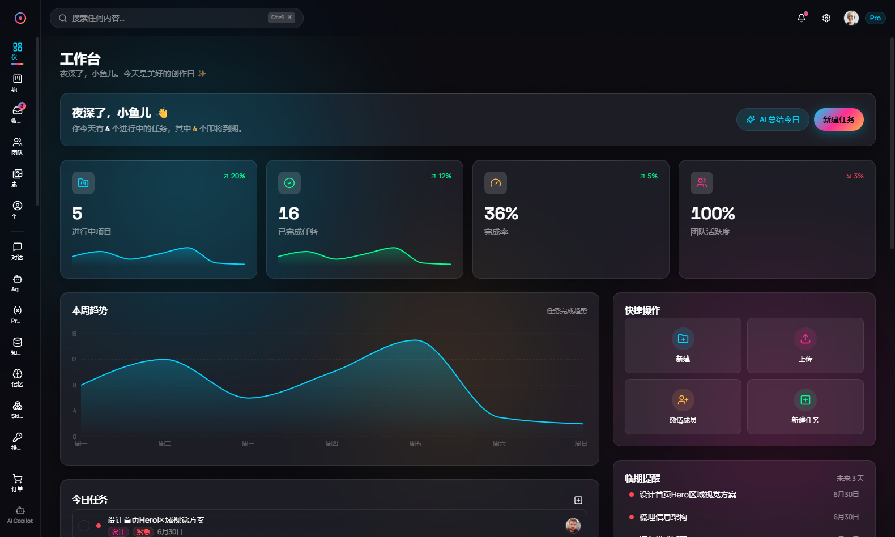
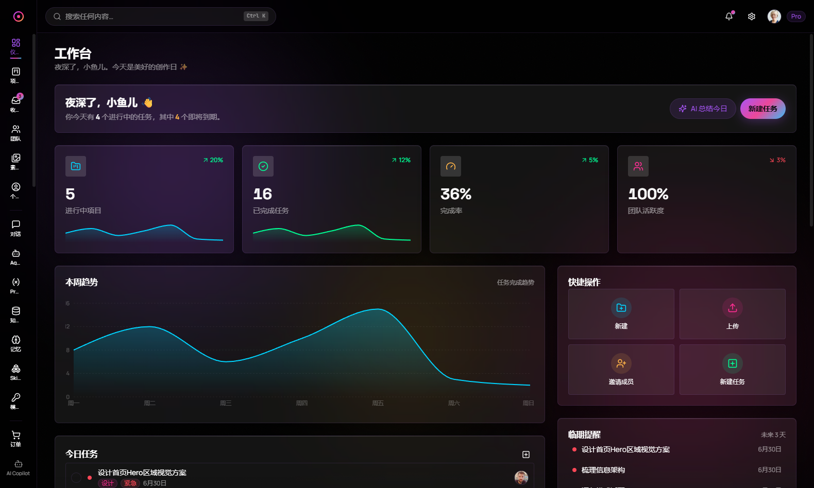
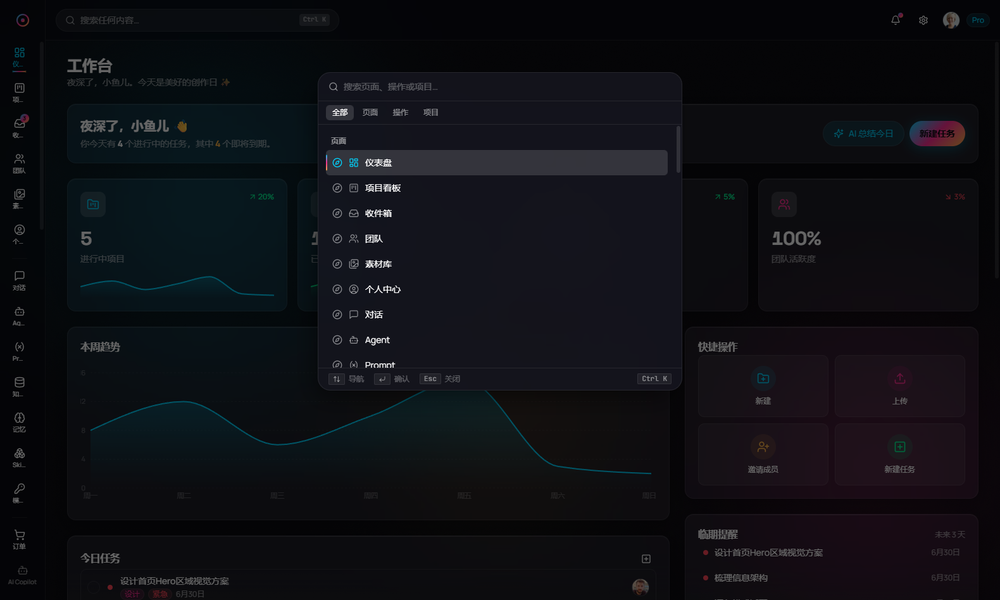
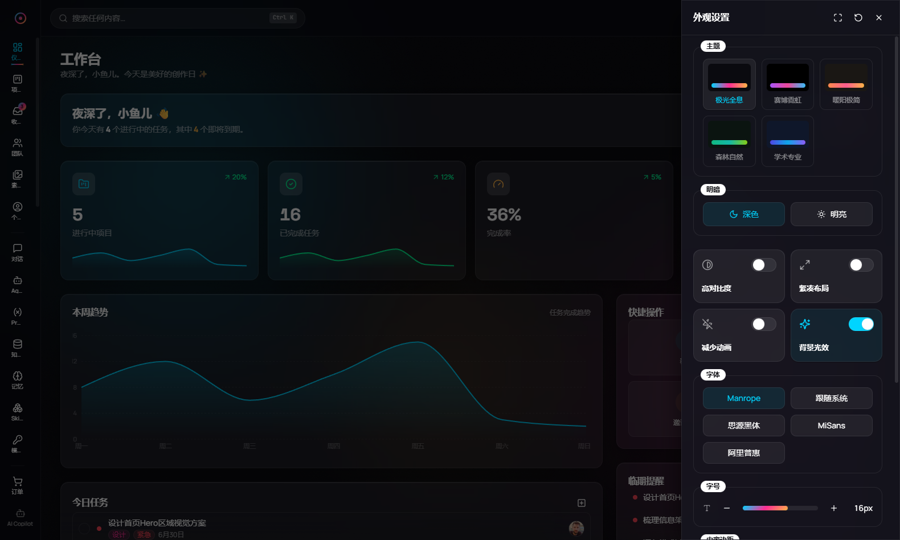

<p align="center">
  
</p>

<h1 align="center">Glass UI React</h1>

<p align="center">暗夜毛玻璃 React 工作台模板</p>

<p align="center">
  <a href="https://glass-ui-react.vercel.app"></a>
</p>

<p align="center">
  
  
  
  
  <a href="README_en.md">English</a>
</p>

---

## 预览

<p align="center">
  
</p>

<p align="center">
  
  
</p>

<p align="center">
  
</p>

---

## 核心特色

- **暗夜毛玻璃 UI** — 磨砂玻璃表面 + 全息渐变 + 环境光效
- **5 套主题** — 极光全息 / 赛博霓虹 / 暖阳极简 / 森林自然 / 学术专业 (各含深色/浅色)
- **注册表驱动架构** — 新增页面只需一行代码，路由/导航/命令面板自动派生
- **40+ 组件** — Radix + shadcn 模式，全 Token 驱动
- **30+ 业务场景** — Dashboard、看板、收件箱、CRM、AI 对话、IoT、医疗…
- **Skills 技能系统** — 插件市场、能力装配、自定义扩展
- **国际化** — 中文 + 英文，`useTranslation()` 全覆盖
- **PWA 支持** — 可安装的渐进式 Web 应用

---

## 技术栈

| 分类       | 技术                          |
|------------|-------------------------------|
| 框架       | React 19 + React Router 7     |
| 构建       | Vite 6 + SWC                  |
| 样式       | Tailwind CSS v4 + CVA         |
| 组件       | Radix UI + shadcn 模式        |
| 状态       | Zustand 5 + TanStack Query 5  |
| 表单       | React Hook Form + Zod         |
| 国际化     | i18next + react-i18next       |
| 图表       | Recharts                      |
| 动画       | Framer Motion                 |
| 拖拽       | @dnd-kit                      |
| Mock API   | MSW 2                         |
| 类型       | TypeScript 5.7                |

---

## 快速开始

```bash
# 安装依赖
pnpm install

# 启动开发服务器
pnpm dev

# 构建生产版本
pnpm build

# 预览构建
pnpm preview

# 类型检查
pnpm typecheck

# 代码检查
pnpm lint
```

---

## 项目结构

```
src/
├── theme/              设计令牌、CSS 变量、主题配置
├── components/
│   ├── ui/             40+ 原子组件 (Button, Dialog, Table...)
│   ├── shared/         业务复合组件 (PageHeader, StatCard...)
│   ├── charts/         图表封装 (recharts)
│   ├── overlays/       命令面板、Copilot 面板
│   └── settings-drawer/  外观设置抽屉
├── scenarios/
│   ├── registry.ts     场景注册表 (单一数据源)
│   ├── _kit/           场景布局模板
│   ├── dashboard/      仪表盘
│   ├── board/          看板
│   ├── skills/         技能插件市场
│   └── ...             30+ 场景
├── layouts/            应用外壳 (侧栏/顶栏/认证布局)
├── api/                TanStack Query hooks
├── mocks/              MSW handlers + fixture 数据
├── store/              Zustand stores
├── i18n/               国际化 (zh-CN, en)
├── routes/             路由路径常量
└── lib/                工具函数 (cn, format, platform)
```

---

## 文档

| 文档         | 描述                       |
|--------------|----------------------------|
| [工程架构](docs/architecture.md) | 分层架构、注册表路由、状态管理 |
| [设计令牌](docs/design-tokens.md) | Token 体系、主题系统、字体方案 |
| [组件库](docs/components.md) | 原子组件、复合组件、工具类 |
| [场景系统](docs/scenarios.md) | 30+ 业务场景、Skills 功能 |
| [UI 设计规范](docs/ui-guide.md) | 视觉规范、间距、排版、动效 |

---

## 联系作者

欢迎交流，扫码添加微信：

<p align="center">
  
</p>

---

## License

AGPL-3.0
